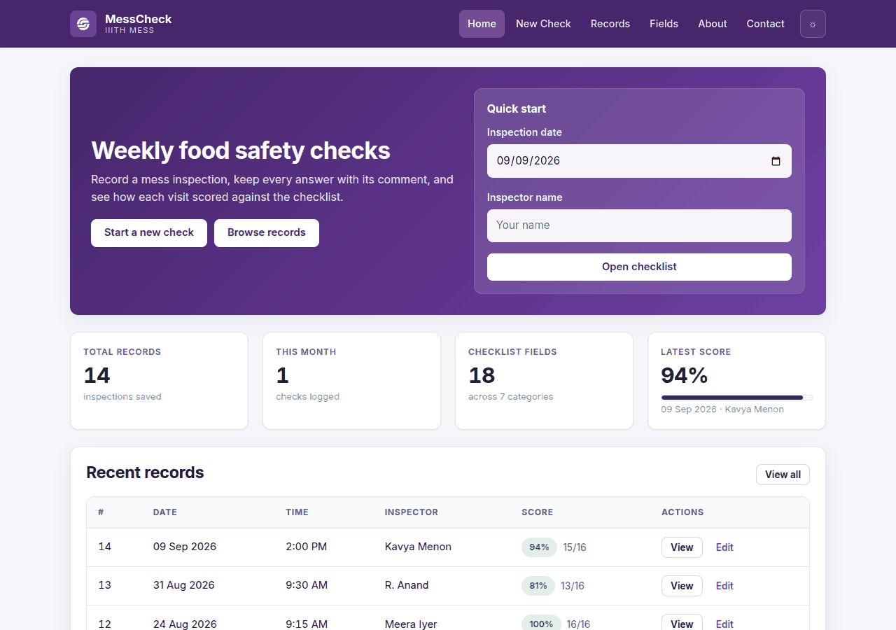
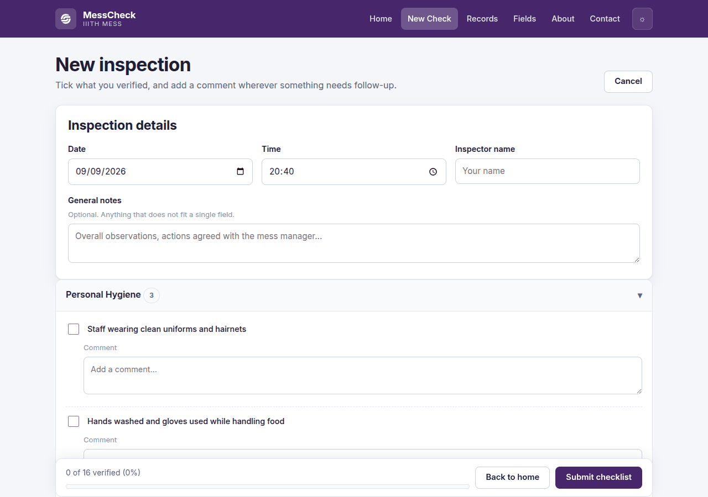
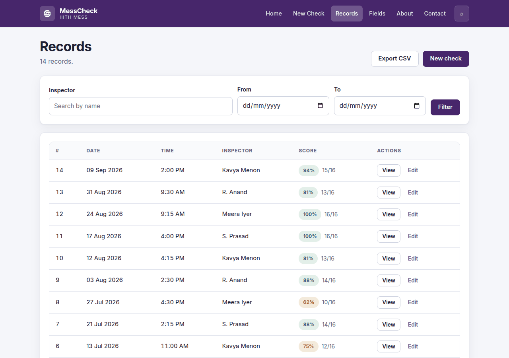
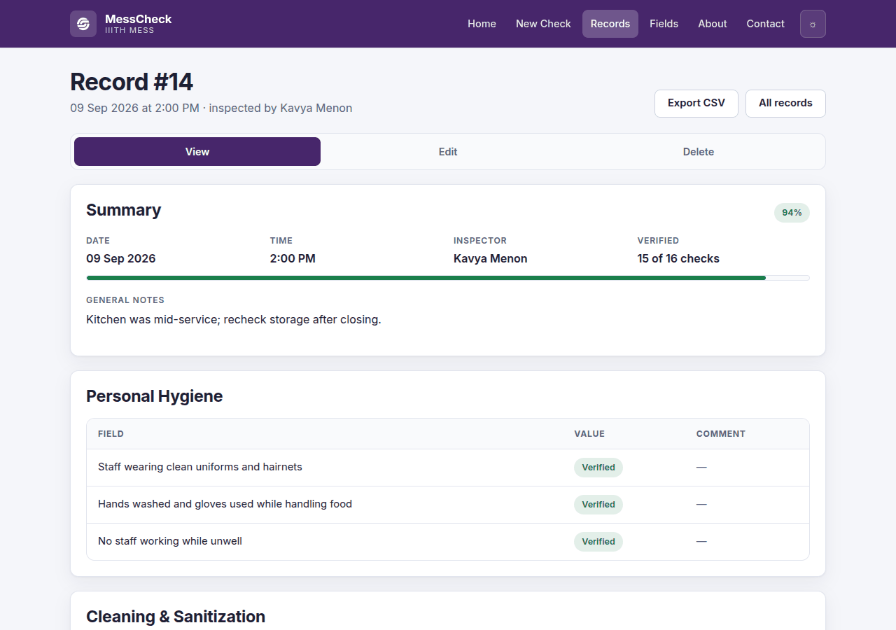
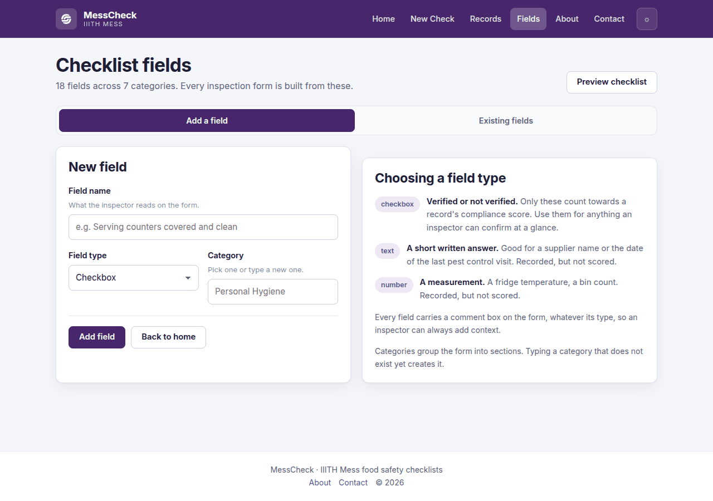
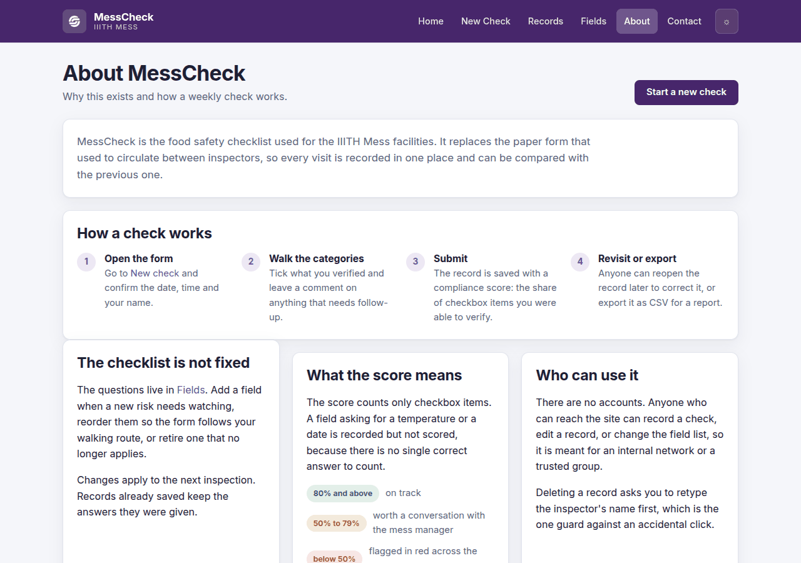
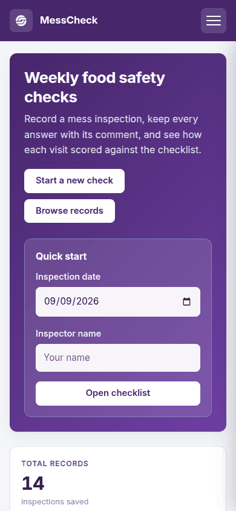
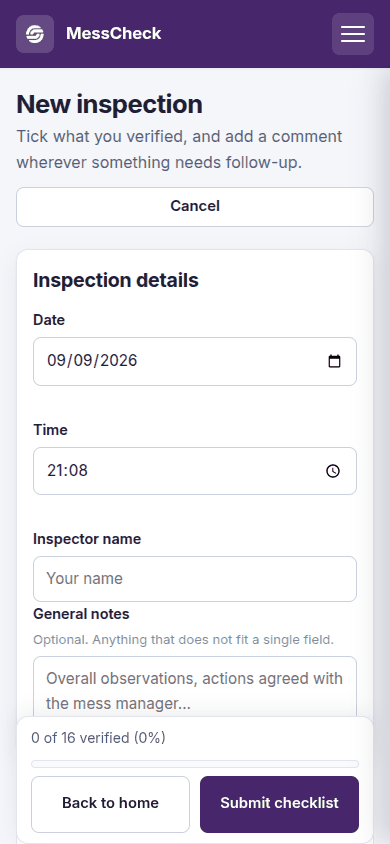
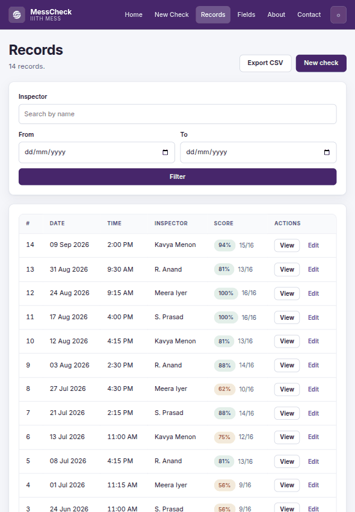

<!-- Generated from README.md by scripts/build_light_readme.py. Do not edit by hand. -->

<div align="center">

<picture>
  <source media="(prefers-color-scheme: dark)" srcset="./docs/assets/adk_dev_logo_light.png">
  
</picture>

# MessCheck

**A food safety inspection checklist for the IIITH mess. Tick what you verified, comment on what needs follow-up, and the visit is saved as a record with a compliance score.**


<br>


<br><br>

**[Developer documentation](./DEVDOC.md)** &middot; [Screenshots](#screenshots) &middot; [Features](#features) &middot; [Getting started](#getting-started)

<p><b>Light mode</b> &middot; <a href="./README.md">View this page in dark mode</a></p>

</div>

---

## Contents

- [Why this project matters](#why-this-project-matters)
- [Screenshots](#screenshots)
- [Responsive layout](#responsive-layout)
- [Features](#features)
- [Roles](#roles)
- [The record lifecycle](#the-record-lifecycle)
- [Tech stack](#tech-stack)
- [Getting started](#getting-started)
- [Contributors](#contributors)
- [Contributing](#contributing)
- [License](#license)

---

## Why this project matters

A mess inspection is a small piece of work that goes wrong in a boring way: the form is
paper, the paper circulates, and by the time anyone asks "was the chimney filter cleaned
last month?" the answer is in a folder somebody took home.

MessCheck replaces the paper form. An inspector opens the checklist, ticks what they
verified, comments on what needs follow-up, and the visit is saved with a compliance score
that can be compared with the previous one.

Two decisions do most of the work. **The checklist is data, not code** - fields live in a
table, so a new risk becomes a new field rather than a code change, and reordering them to
follow the inspector's walking route is a drag rather than a deploy. And **every field
carries a comment box, whatever its type**, because the useful part of an inspection is
rarely the tick: it is the sentence explaining why two staff were at the counter without
hairnets.

The score deliberately counts only checkbox items. A fridge temperature is recorded but not
scored, because there is no single correct answer to count, and a score that quietly folds
in a judgement call is a score nobody trusts.

## Screenshots

Real 1280x900 viewport renders against the demo data that `flask --app app seed-demo`
writes. This page shows **light mode**; the same gallery in dark mode is at
**[README.md](./README.md)**.

<table>
  <tr>
    <td width="33%" valign="top">
      
      <p align="center"><b>Home</b><br><sub>Start a check, or see how the last one scored.</sub></p>
    </td>
    <td width="33%" valign="top">
      
      <p align="center"><b>New inspection</b><br><sub>Grouped by category, with a live progress bar.</sub></p>
    </td>
    <td width="33%" valign="top">
      
      <p align="center"><b>Records</b><br><sub>Every visit, scored, searchable, exportable as CSV.</sub></p>
    </td>
  </tr>
  <tr>
    <td width="33%" valign="top">
      
      <p align="center"><b>A record</b><br><sub>What was verified, what was said, and the score.</sub></p>
    </td>
    <td width="33%" valign="top">
      
      <p align="center"><b>Fields</b><br><sub>The checklist is data: add, retype, reorder, retire.</sub></p>
    </td>
    <td width="33%" valign="top">
      
      <p align="center"><b>About</b><br><sub>How a check works, and what the score does not count.</sub></p>
    </td>
  </tr>
</table>

## Responsive layout

An inspection happens walking around a kitchen, so the phone layout is the one that matters.
Each of these is a single render at that exact viewport, not a scaled-down desktop shot.

<table>
  <tr>
    <td width="28%" valign="top">
      
      <p align="center"><b>Phone, 390x844</b><br><sub>The nav collapses to a drawer; quick start stays first.</sub></p>
    </td>
    <td width="28%" valign="top">
      
      <p align="center"><b>Phone, the form</b><br><sub>Progress and both buttons pinned to the bottom.</sub></p>
    </td>
    <td width="44%" valign="top">
      
      <p align="center"><b>Tablet, 820x1180</b><br><sub>The record table keeps its columns; filters go two-up.</sub></p>
    </td>
  </tr>
</table>

## Features

### Running a check
- Start from the home page by entering a date and your name, or open the blank form directly
- Fields are grouped into collapsible categories so a long checklist stays manageable
- Every field carries a comment box, whatever its type, for context that does not fit a tick
- A progress bar counts verified items as you work down the form
- The form validates the date, time and inspector name before saving, and hands back what
  you typed if something is wrong

### Records
- Every record shows a compliance score: the share of checkbox items that were verified
- Scores are colour coded - green at 80% and above, amber from 50%, red below
- Search by inspector name and filter by date range
- Each record has three tabs: view the answers, edit them, or delete the record
- Editing can untick a box, and the change sticks
- Deleting asks you to retype the inspector's name, and the button stays disabled until it
  matches
- Export one record, or the whole filtered list, as CSV

### Managing the checklist
- Add, rename, retype, reorder and delete the fields the form is built from
- Three field types: checkbox (scored), short text and number (recorded, not scored)
- Categories group the form into sections; typing a category that does not exist creates it
- Deleting a field also removes the answers recorded against it, and says so first
- Renaming or moving a field leaves existing answers untouched

### Interface
- Works on a phone: the nav becomes a drawer and record tables stack into labelled cards
- Light and dark themes, following the system setting until you pick one
- Records print cleanly - navigation, tabs and buttons drop out, and all tabs expand

## Roles

There are no accounts. Anyone who can reach the site can record a check, edit a record, or
change the field list, so it is meant for an internal network or a trusted group. See
[DEVDOC.md](./DEVDOC.md#known-constraints-and-gotchas) before putting it on the open web.

## The record lifecycle

1. **Draft** - the form is open in the browser. Nothing is stored yet.
2. **Saved** - submitting writes the record header (date, time, inspector, notes) and one row
   per answered field. The score is computed from the checkbox answers.
3. **Amended** - editing rewrites every answer for that record, so unticking a box or clearing
   a comment removes it rather than leaving the old value behind.
4. **Deleted** - a confirmed delete removes the record and its answers together.

A record keeps the fields it was answered against. Adding a new field does not retroactively
mark old records as failing it - the field simply has no answer there.

## Tech stack

Flask 3 and SQLite, server-rendered Jinja templates, no build step and no front-end
framework. Detail in [DEVDOC.md](./DEVDOC.md).

## Getting started

```bash
python3 -m venv .venv && .venv/bin/pip install -r requirements.txt
.venv/bin/python app.py
```

Then open http://127.0.0.1:5000. The database is created and seeded with a default checklist
on first run.

A fresh database has the checklist but no visits, so the records screens are empty. To look
around something that has been in use:

```bash
.venv/bin/flask --app app seed-demo    # 14 weekly visits, scored and commented
```

Full setup and deployment notes are in [DEVDOC.md](./DEVDOC.md#local-development).

## Contributors

<table>
  <tr>
    <td align="center">
      <a href="https://github.com/Dileepadari">
        
        <br><sub><b>Dileep Adari</b></sub>
      </a>
      <br><sub>Author and maintainer</sub>
    </td>
  </tr>
</table>

## Contributing

Issues and pull requests are welcome at
[github.com/Dileepadari/MessCheck](https://github.com/Dileepadari/MessCheck).

Before opening a pull request:

```bash
python -m pytest -q                 # 35 tests, no setup
```

CI runs the same suite on Python 3.11, 3.12 and 3.13, boots the app against a seeded
database and fetches the pages that read it, and audits the dependencies. Keep commit
messages to a single line, and match the surrounding code rather than introducing a new
style. [DEVDOC.md](./DEVDOC.md) explains the architecture and the data model.

If you change `README.md`, regenerate its light-mode twin so the pair stays in sync:

```bash
python scripts/build_light_readme.py
```

## License

MIT. See [LICENSE](./LICENSE).
